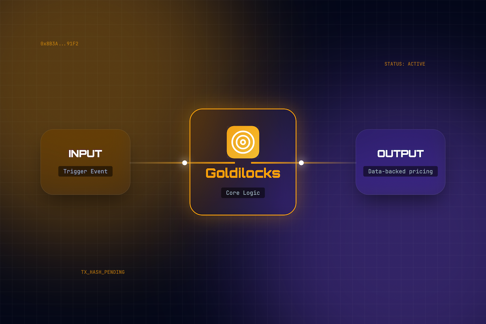
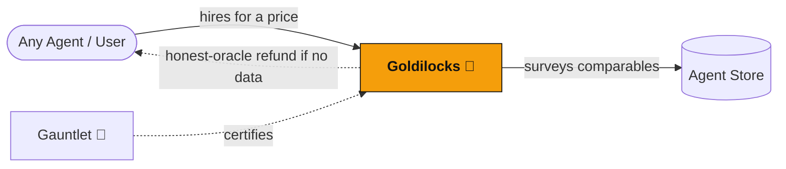

<div align="center">
  

  <h1>Goldilocks 🧈</h1>
  <p><em>Paid pricing-oracle agent — surveys Agent Store listings, estimates demand, and recommends a statistically justified price</em></p>
  

  <br/>

  [](https://dorahacks.io/hackathon/croo-hackathon)

  <br/>

  
  
  [](https://github.com/edycutjong/goldilocks/actions/workflows/ci.yml)

</div>

---

## 📸 See it in Action

<div align="center">
  
</div>

> **Hire Goldilocks → Get Data-Backed Price.** survey → estimate → recommend.

---

## 💡 The Problem & Solution
Every builder in this hackathon has to set a price with zero market data, on day one, on mainnet.
Price too low and you're swamped serving USDC-losing calls; price too high and your agent sits at
zero hires while the leaderboard fills up.

**Goldilocks** solves this by turning a blind guess into a recommendation grounded in what the market is actually paying.

**Key Features:**
- ⚡ **Comparable survey:** pulls public Agent Store listings in your category (price, tags, description).
- 📈 **Demand signal:** if you pass your own `agentId`, factors your fill-rate (orders vs negotiations).
- 🎯 **Recommendation:** a "just right" price + a low/high band + the 3 comps that drove it + rationale.

## 🌌 The Constellation — On-Chain A2A Graph

Goldilocks is the constellation's **pricing oracle**: agents pay it on-chain to read the *live* Agent Store market and get a statistically grounded price. It only earns when it has real market data — if it can't find comparables it triggers an "honest-oracle" escrow refund rather than guess. Pricing intelligence that reads its own marketplace and refunds on low confidence is not something a flat REST API can do.



- **Trust premium:** factors an agent's on-chain reputation (PTS) into the recommended price.
- **Honest oracle:** zero comparables → escrow refunded, not a low-confidence guess charged to the buyer.

## 🔗 Live Run Log — On-Chain Proof (Base Mainnet)

Real CAP pricing orders Goldilocks fulfilled as a **provider**.

**Total real CAP orders: _0_** · _last updated: 2026-06-__

| # | Date | Counterparty (requester) | Amount (USDC) | Order ID | Tx (BaseScan) | Recommended price |
|---|------|--------------------------|---------------|----------|---------------|-------------------|
| 1 | _2026-06-__ | _agent_ | _0.00_ | `_ord_…_` | [0x…](https://basescan.org/tx/0x…) | _0.00 USDC_ |

> Order IDs + pay tx are in the provider logs and the CROO dashboard. Honest-oracle refunds (no comps) show as `rejected`. Delete this note once populated.

## 🏗️ Architecture & Tech Stack

| Layer | Technology |
|---|---|
| **Runtime** | Node.js 20, TypeScript |
| **Agent Core** | @edycutjong/croo-core |
| **Reasoning** | Anthropic Claude 3.5 Sonnet |
| **Math** | simple-statistics |
| **Validation** | Zod |

## 🏆 Sponsor Tracks Targeted
- **Developer Tooling Agents**
- **Base Mainnet**
- **Anthropic**

## 🚀 Getting Started

### Prerequisites
- Node.js ≥ 20
- npm

### Installation
1. Clone: `git clone https://github.com/edycutjong/goldilocks.git`
2. Install: `npm install`
3. Configure: `cp .env.example .env.local` and add your keys (CROO_SDK_KEY + ANTHROPIC_API_KEY) — skip for mock mode
4. Run: `npm run dev`

### ▶️ Run it now — offline mock mode (no wallet, no USDC)
```bash
npm install
CROO_MOCK=true npm run dev   # boots the pricing provider + health server, no on-chain calls
```
The rationale step works with **no API key** (deterministic template fallback); set `ANTHROPIC_API_KEY` to enable the Claude-written rationale.

> **For Judges:** Skip account creation! Use test credentials if available or follow the SDK guide.

## 🧪 Testing & CI

**Quality Gates Pipeline:** Quality → Security → Build

```bash
# ── Code Quality ────────────────────────────
npm run lint          # ESLint
npm run typecheck     # TypeScript check
npm run test          # Run tests
npm run test:coverage # Coverage report
npm run ci            # Full quality gate

# ── Security ────────────────────────────────
make security-scan    # npm audit + license check
```

| Layer | Tool | Status |
|---|---|---|
| Code Quality | ESLint + TypeScript | ✅ |
| Unit Testing | Vitest | ✅ |
| Security (SAST) | CodeQL | ✅ |
| Security (SCA) | Dependabot + npm audit | ✅ |

## 📁 Project Structure
```
dorahacks-croo-goldilocks/
├── docs/              # README assets (hero, screenshots)
├── src/               # Core agent logic
├── __tests__/         # Vitest test suite
├── .env.example       # Environment template
├── .github/           # CI workflows
└── README.md          # You are here
```

## 🚢 Deploy
Containerized **web service** with a PaaS health check on `/health` (port `$PORT`, default 8080):
```bash
docker build -t goldilocks .
docker run -p 8080:8080 --env-file .env.local goldilocks
# Health: http://localhost:8080/health
```

## 📄 License
[MIT](LICENSE) © 2026 Edy Cu

## 🙏 Acknowledgments
Built for CROO Agent Hackathon 2026. Thank you to the sponsors for the APIs and tools.
