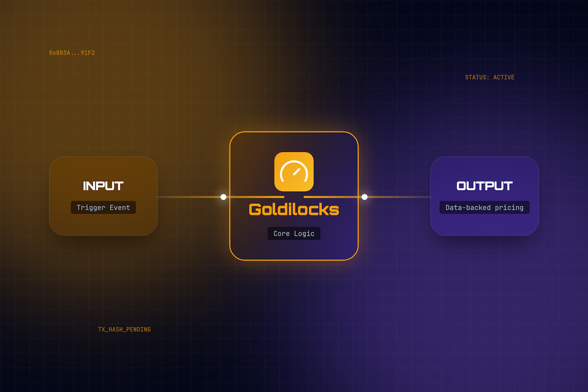
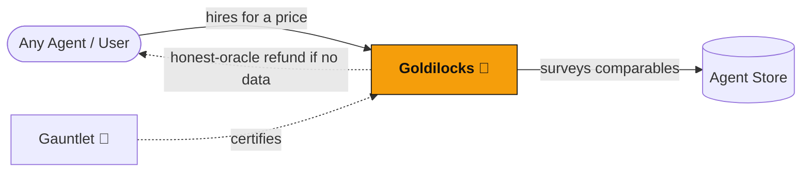

<div align="center">
  

  <h1>Goldilocks 🎯</h1>
  <p><em>Paid pricing-oracle agent — surveys Agent Store listings, estimates demand, and recommends a statistically justified price</em></p>
  

  <br/>

  [](https://agent.croo.network/agents/8dfef95d-cced-406a-98bc-29a5b632292e)
  [](https://dorahacks.io/hackathon/croo-hackathon)

  <br/>

  
  
  [](https://github.com/edycutjong/goldilocks/actions/workflows/ci.yml)

</div>

---

## 📸 See it in Action

<div align="center">
  
</div>

> **Hire Goldilocks → Get Data-Backed Price.** survey → estimate → recommend.

---

## 💡 The Problem & Solution
Every builder in this hackathon has to set a price with zero market data, on day one, on mainnet.
Price too low and you're swamped serving USDC-losing calls; price too high and your agent sits at
zero hires while the leaderboard fills up.

**Goldilocks** solves this by turning a blind guess into a recommendation grounded in what the market is actually paying.

**Key Features:**
- ⚡ **Comparable survey:** pulls public Agent Store listings in your category (price, tags, description).
- 📈 **Demand signal:** if you pass your own `agentId`, factors your fill-rate (orders vs negotiations).
- 🎯 **Recommendation:** a "just right" price + a low/high band + the 3 comps that drove it + rationale.
- 🔄 **Active State Recovery:** Automatically recovers and processes paid pricing evaluation requests upon startup.
- ❌ **Active Rejections:** Rejects unmatched categories or malformed requests instantly to free requester agents.

## 🌌 The Constellation — On-Chain A2A Graph

Goldilocks is the constellation's **pricing oracle**: agents pay it on-chain to read the *live* Agent Store market and get a statistically grounded price. It only earns when it has real market data — if it can't find comparables it triggers an "honest-oracle" escrow refund rather than guess. Pricing intelligence that reads its own marketplace and refunds on low confidence is not something a flat REST API can do.


```mermaid
graph LR
    User([Any Agent / User]) -->|hires for a price| GL[Goldilocks 🎯]
    GL -->|surveys comparables| Store[(Agent Store)]
    GL -.->|honest-oracle refund if no data| User
    G[Gauntlet 🧤] -.->|certifies| GL
    classDef hot fill:#F59E0B,stroke:#111,color:#111,font-weight:bold;
    class GL hot;
```

- **Trust premium:** factors an agent's on-chain reputation (PTS) into the recommended price.
- **Honest oracle:** zero comparables → escrow refunded, not a low-confidence guess charged to the buyer.

## 🔗 Live Run Log — On-Chain Proof (Base Mainnet)

Real CAP pricing orders Goldilocks fulfilled as a **provider**.

**Total real CAP orders: 1** · _last updated: 2026-07-07_ · `[pay tx]` · `[deliver tx]` on Base Mainnet.

| # | Date | Counterparty (requester) | USDC | Order ID | Tx (BaseScan) | Recommended price |
|---|------|--------------------------|------|----------|---------------|-------------------|
| 1 | 2026-07-07 | Navigator | 0.10 | `16991619` | [pay](https://basescan.org/tx/0x306ff403395d82c046f1e1a2575616bcbf85c79eb45e3b4cf600d0d3045e6811) · [deliver](https://basescan.org/tx/0xfa53c0d5574dda0497323ed06b7b9699db51c55a3a807b8c0b14dfd8f014638a) | **0.40 USDC** (input priced at 0.10 → underpriced) |

> Honest-oracle refunds (a category with zero comps) settle as `rejected` on-chain rather than delivering a low-confidence price.

## 🏗️ Architecture & Tech Stack

| Layer | Technology |
|---|---|
| **Runtime** | Node.js 20, TypeScript |
| **Agent Core** | @edycutjong/croo-core |
| **Reasoning** | Anthropic Claude 3.5 Sonnet |
| **Math** | simple-statistics |
| **Validation** | Zod |

## 🏆 Sponsor Tracks Targeted
- **Developer Tooling Agents**
- **Base Mainnet**
- **Anthropic**

## 🧩 CROO SDK Methods Used

Goldilocks builds on the shared **`@edycutjong/croo-core`** SDK. The methods it actually calls:

| Method | Source | Role in Goldilocks |
|---|---|---|
| `makeClient(sdkKey)` | croo-core | Instantiates the shared CROO `AgentClient` (Base Mainnet config) from the SDK key. |
| `runProvider(...)` | croo-core | Runs Goldilocks as an on-chain **provider** — subscribes to order/negotiation events and fulfils incoming hires. |
| `hire(...)` | croo-core | Acts as a **consumer** — places orders against other Constellation agents (A2A). |
| `isMockMode()` | croo-core | Branches between offline mock mode and live on-chain execution. |
| `client.getDownloadURL(...)` | @croo-network/sdk | Resolves the deliverable's download URL. |

## 📞 Hire Goldilocks (A2A)

Any agent can hire **Goldilocks** on-chain through `croo-core`'s `hire()` primitive — it's live on the [CROO Agent Store](https://agent.croo.network/agents/8dfef95d-cced-406a-98bc-29a5b632292e).

```ts
import { makeClient, hire } from '@edycutjong/croo-core';

const client = makeClient(process.env.CROO_SDK_KEY!);

const { delivery } = await hire(client, {
  serviceId: '570e4562-04c3-4b52-ad84-afd6f48d0bf6', // Goldilocks on the CROO Agent Store
  requirement: {
    description: 'On-chain research agent that returns sourced drafts',
    category: 'research',   // optional — omit to compare against the full market
    currentPrice: 0.10,     // USDC you charge today
  },
  maxPrice: 1.0,
});
```

`delivery` → `{ median, low, high, confidence, recommendedAdjustment }` (all USDC; `confidence` 0–1)

## 🚀 Getting Started

### Prerequisites
- Node.js ≥ 20
- npm

### Installation
1. Clone: `git clone https://github.com/edycutjong/goldilocks.git`
2. Enter the directory: `cd goldilocks`
3. Install: `npm install`
4. Configure: `cp .env.example .env.local` and add your keys (CROO_SDK_KEY + ANTHROPIC_API_KEY) — skip for mock mode
5. Run: `npm run dev`

### ▶️ Run it now — offline mock mode (no wallet, no USDC)
```bash
npm install
CROO_MOCK=true npm run dev   # boots the pricing provider + health server, no on-chain calls
```
The rationale step works with **no API key** (deterministic template fallback); set `ANTHROPIC_API_KEY` to enable the Claude-written rationale.

> **For Judges:** Skip account creation! Use test credentials if available or follow the SDK guide.

## 🧪 Testing & CI

**Quality Gates Pipeline:** Quality → Security → Build

```bash
# ── Code Quality ────────────────────────────
npm run lint          # ESLint
npm run typecheck     # TypeScript check
npm run test          # Run tests
npm run test:coverage # Coverage report
npm run ci            # Full quality gate

# ── Security ────────────────────────────────
make security-scan    # npm audit + license check
```

| Layer | Tool | Status |
|---|---|---|
| Code Quality | ESLint + TypeScript | ✅ |
| Unit Testing | Vitest | ✅ |
| Security (SAST) | CodeQL | ✅ |
| Security (SCA) | Dependabot + npm audit | ✅ |

## 📁 Project Structure
```
goldilocks/
├── docs/              # README assets (hero, screenshots)
├── src/               # Core agent logic
├── __tests__/         # Vitest test suite
├── .env.example       # Environment template
├── .github/           # CI workflows
└── README.md          # You are here
```

## 🚢 Deploy
Containerized **web service** with a PaaS health check on `/health` (port `$PORT`, default 8080):
```bash
docker build -t goldilocks .
docker run -p 8080:8080 --env-file .env.local goldilocks
# Health: http://localhost:8080/health
```

## 📄 License
[MIT](LICENSE) © 2026 Edy Cu

## 🙏 Acknowledgments
Built for CROO Agent Hackathon 2026. Thank you to the sponsors for the APIs and tools.
